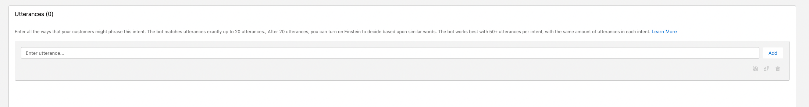
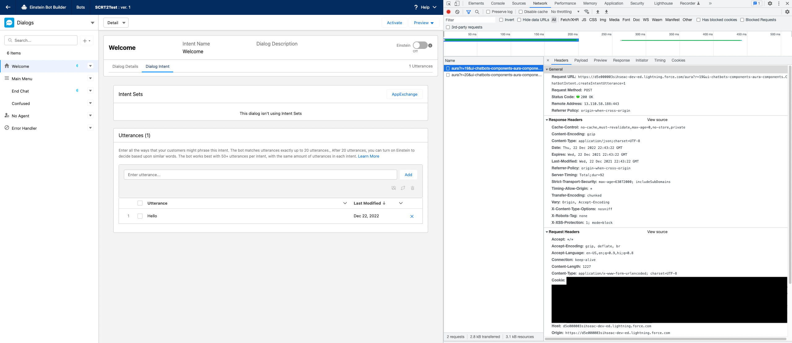
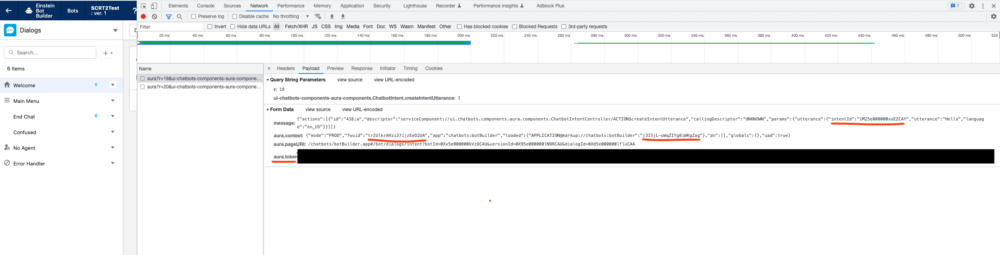
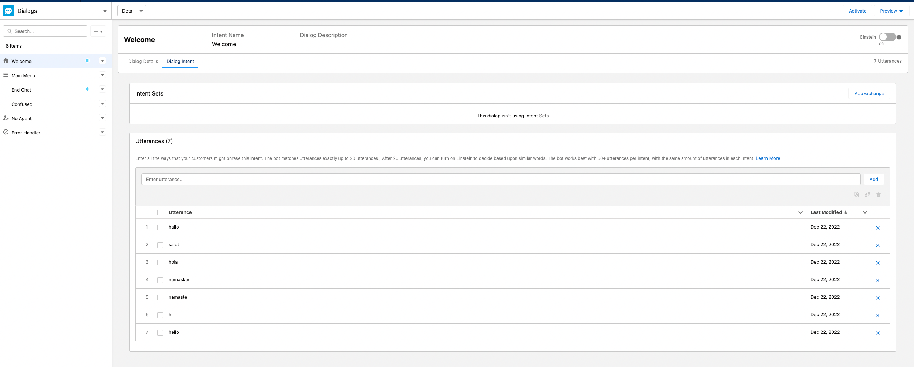

# Salesforce Einstein Bots Intent Utils
Collection of utility scripts to work with intents for [Salesforce Einstein Bots](https://help.salesforce.com/s/articleView?id=sf.bots_service_intro.htm&type=5).

## - Bulk upload utterances for local intents
As of today, admins need to add utterances one at a time when creating a local intent set under a dialog using the following UI tool


The python script `./utterance_upload/main.py` addresses this issue by reading a user defined text file of utterances and bulk uploads them to your Einstein Bot.
The script is uses cookies and auth tokens from the Salesforce BotBuilder page UI. Following are the usage instructions:

1. Deactivate your Einstein Bot
2. On the Bot builder page navigate to the dialog for which you want to add utterances for intent training
3. Right-click on the page and click `Inspect` and open the `Network` tab under Google Chrome's Developer tools
4. Manually add one utterance (we need to do this step in order to get the initial cookie and the auth token). You should see something like the following:

5. From the `Request Headers` section of the find the `Cookie` property and in the cookie, find and note down the `sid` property. For example, in the above image, the `sid` should be `00D5e000003Sihs!AQ4AQJqYErR44W_j9R2r9ac3.OPcXHAzTzP.IP8AkBjG81meiEy12LhbZNy7W0JIJwcbJ2Y0peCDSvJl_.W1nqHs0bJnSG9j`. We will need this `sid` later.
6. Next click on the `Payload` section and note down the `intentId`, `fwuid`, `application markupid` and the `auth.token`. See the following:

7. From the URL of the Bot builder page get the `Domain`, `Bot-Id`, `Bot-Version-Id, and the `Current-Dialog-Id`. For example, for the following bot-builder URL:
```
https://d5e000003sihseac-dev-ed.lightning.force.com/chatbots/botBuilder.app#/bot/dialogs/intent?botId=0Xx5e000000kVzQCAU&versionId=0X95e000000lN9RCAU&dialogId=0Xd5e000000lfluCAA

Domain = d5e000003sihseac-dev-ed.lightning.force.com
Bot-Id = 0Xx5e000000kVzQCAU
Bot-Version-Id = 0X95e000000lN9RCAU
Current-Dialog-Id = 0Xd5e000000lfluCAA
```
8. Create a local text file with each utterance on a new line, following is an example:
```
hello
hi
namaste
namaskar
hola
salut
hallo
```
9. Now we have all the information to invoke the script to bulk upload utterances. Assuming you have created a local utterance file called `utterances.txt` Following is the command:
```
./main.py -domain=<Domain> -intent-id=<intentId> -lang=<Your Bots Language> -bot_id=<Bot-Id> -bot_version_id=<Bot-Version-Id> -bot_dialog_id=<Current-Dialog-Id> -token=<auth.token> -sid=<sid> -utterances=./utterances.txt -fwuid=<fwuid> -lid=<application markupid> 
```
10. As long as you copied everything correctly, the script should do its job and once done, refresh the bot-builder page and you should see your utterances in the UI:

11. If you want to bulk upload utterances for any other dialog then navigate to that dialog and repeat steps 6 to 9 